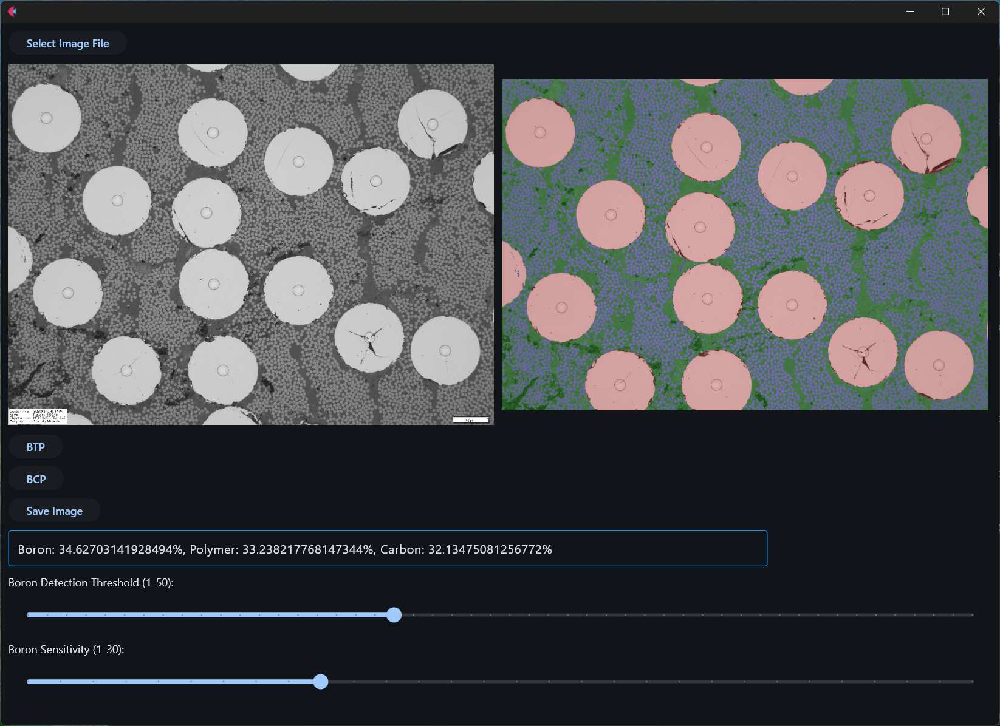

# Composite Substance Quantifier
Computer vision algorithm for detection of boron, carbon fiber, tungsten, and polymer percentages in a microscope image.  

## Logic 

Composite Element Detection operates in two modes: BCP, for boron carbon polymer composites, and BTP, for boron tungsten polymer composites. 

### BCP Logic

BCP operation has three primary stages: circle fitting, to identify whole boron fibers; circle validation, to remove invalid boron detection; and thresholding, to identify boron fragments, carbon, and polymer regions. Circle fitting is used in addition to thresholding to include boron voids, which would otherwise be incorrectly identified as polymer. 

Circle fitting is excessive to ensure all boron is identified; as a result, many extraneous circles are also identified. Circle sensitivity is controlled with Parameter 3. Circle candidates are validated by analyzing the average brightness of the original image in the area contained by each circle; a low average brightness is likely polymer, and high, boron. Brightness detection threshold is controlled with Parameter 4. The remaining circles are assumed to be correctly identified boron fibers and the associated regions are removed from the subsequent thresholding steps. 

The image is then thresholded for three brightnesses: high, which identifies boron fragments that circle detection did not identify, middle, which identifies carbon fiber, and low, which identifies polymer. 

### BTP Logic

BTP operation is similar to BCP. Boron and tungsten are grouped identified and validated with the same circle and thresholding logic. To separate boron from tungsten, a subtle hue difference is used. The remaining polymer is thresholded, and the image is returned to the user for optional correction. Using a mouse, tungsten fibers or fragments that have been mischaracterized as boron are identified. The algorithm runs a second time with these data, and the final detection is produced. 

## Usage 

This section describes usage of the GUI. The code can also be run direclty using "main.py" and "Parameters.txt," drawing from the "Images" folder. 

Download the project (https://specialtymaterials.box.com/s/zaohe1jm6jwjm4j4a7abt711j3otz8lp) to run the executable inside the 'dist' folder, or 
launch the GUI directly with GUI.py. Expand the window if necessary. Input the requested image (must have '10x' or '20x' in the file name) and process Boron Carbon Polymer (BCP) or Boron Tungsten Polymer (BTP) mode, depending on the type of composite being characterized. In BTP mode, a window prompting manual correction will appear. The mouse may be used to click on additional tungsten fibers or fragments that have been mischaracterized as boron. After corrections have been made, or if none were needed, press 'd'. After reprocessing is complete for either mode, the percentages of each substance will be presented in the text box. Detection quality should be confirmed in the result window; if needed, the sliders Boron Detection Threshold and Boron Sensitivity may be adjusted. 

Boron detection threshold: threshold with which fitted boron candidates are validated
Boron sensitivity: sensitivity with which circles are fitted to boron fiber candidates